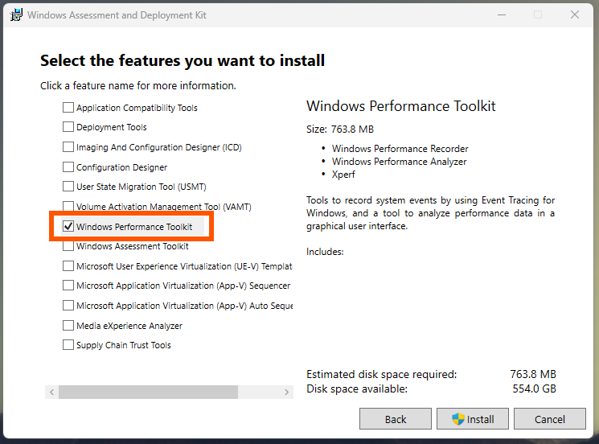
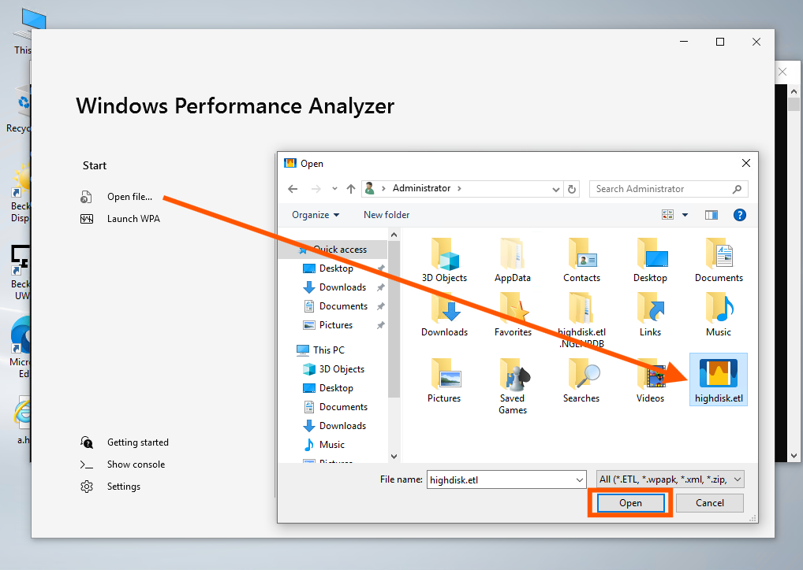
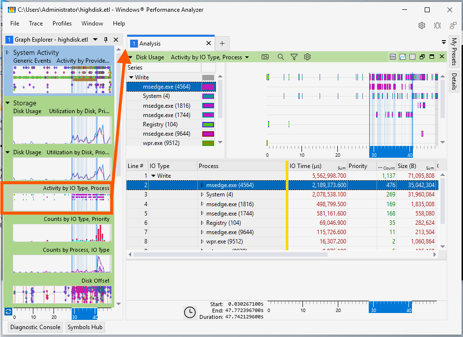
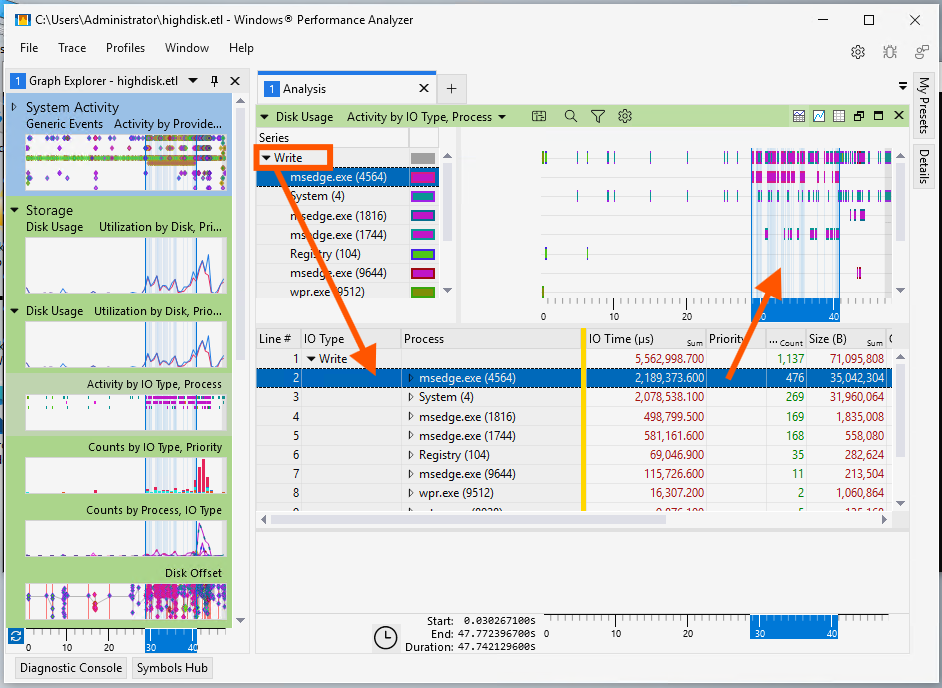

# Tools - Windows Performance Toolkit for HDD Write Monitoring

## Disclaimer

This guide is a personal project and not a peer-reviewed publication or sponsored document. It is provided “as is,” without any warranties—express or implied—including, but not limited to, accuracy, completeness, reliability, or suitability for any purpose. The author(s) shall not be held liable for any errors, omissions, delays, or damages arising from the use or display of this information.

All opinions expressed are solely those of the author(s) and do not necessarily represent those of any organization, employer, or other entity. Any assumptions or conclusions presented are subject to revision or rethinking at any time.

Use of this information, code, or scripts provided is at your own risk. Readers are encouraged to independently verify facts. This content does not constitute professional advice, and no client or advisory relationship is formed through its use.

## Description

This repository demonstrates how to use Windows Performance Toolkit to see what processes are writing to the hard drive.

## Requirements

- Windows 10 or later
- Admin privileges
- Windows Performance Toolkit

## Step 1: Install Windows Performance Toolkit

1. Download the **Windows ADK**:
   [https://learn.microsoft.com/en-us/windows-hardware/get-started/adk-install](https://learn.microsoft.com/en-us/windows-hardware/get-started/adk-install)

2. During setup, select only the Windows Performance Toolkit



This installs:

- `WPR.exe` (recorder)
- `WPA.exe` (analyzer)

## Step 2: Start a Disk I/O Trace

1. Open **Command Prompt as Administrator**.
2. Start the trace using:

   ```sh
   WPR -start diskio -filemode
   ```

   This will begin recording detailed disk write activity to disk.

## Step 3: Reproduce the Disk Activity

- Let your computer run normally, or perform the action that causes high disk usage.
- Record for a few minutes.

## Step 4: Stop and Save the Trace

When you're ready, stop the trace and save the results:

```sh
WPR -stop highdisk.etl
```

This creates a file named `highdisk.etl` that contains performance trace data.

## Step 5: Analyze the Trace with WPA

1. Launch **Windows Performance Analyzer**:

   ```sh
   wpa.exe
   ```

2. Open the `highdisk.etl` file.

   

3. In the left-hand Graph Explorer pane, add the following graph:

   - `Activity by IO Type, Process`

   

4. Drill down by:

   - **Write**
   - **Process**

   

## Clean Up

You can delete `.etl` files after analysis. They may be large depending on trace duration.

## Uninstall

Windows Performance Analyzer can be uninstalled using the standard "Add remove programs" and uninstalling the "Windows Assessment and Deployment Kit" (may also be under Windows Performance Toolkit).
